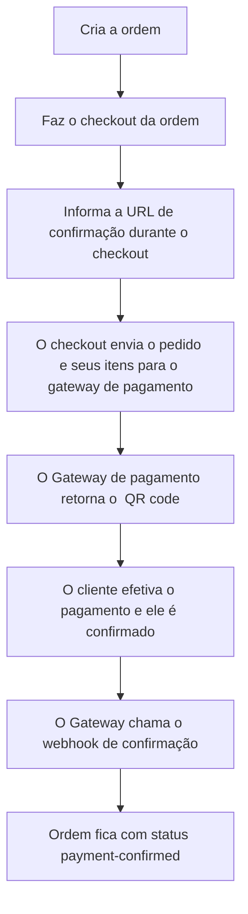
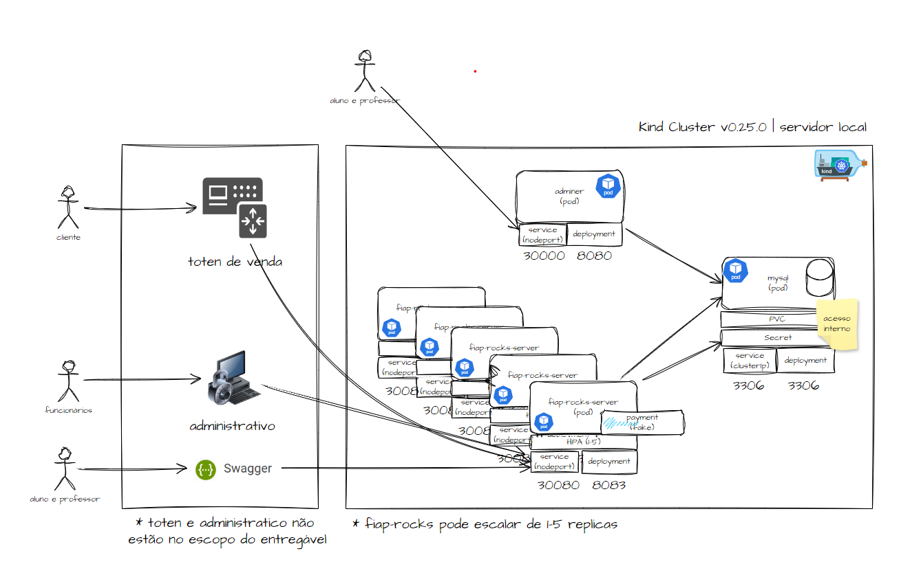
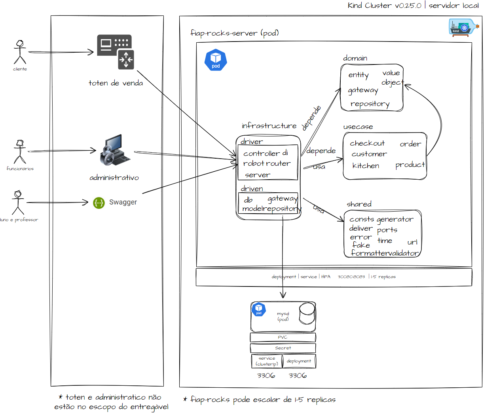
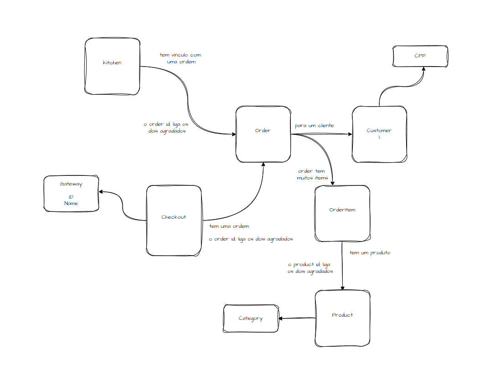

# Kitchen Control | fase 2

## Índice

- [Descrição](#descrição)
- [Tecnologias usadas no projeto](#tecnologias-usadas-no-projeto)
- [Instalação e acesso ao swagger](#instalação-e-acesso-ao-swagger)
  - [Pré-requisitos](#pré-requisitos)
  - [Como instalar e executar o Kitchen Control](#como-instalar-e-executar-o-kitchen-control)
- [Endpoints (acesso via swagger)](#endpoints-acesso-via-swagger)
- [Client para DB - Adminer](#client-para-db---adminer)
- [Gerador de CPF para os testes](#gerador-de-cpf-para-os-testes)
- [Como usar o swagger da api](#como-usar-o-kitchen-control)
  - [Cadastros Básicos](#cadastros-básicos)
    - [Criar produtos](#criar-produtos)
  - [Criar ordem, fazer o pagamento e cozinha](#criar-pedidos-fazer-pagamentos-e-cozinha)
- [Requisitos](#requisitos-funcionais-da-fase-2)
- [Arquitetura](#arquitetura)
- [Testes](#testes)

## Descrição

A Kitchen Control API é uma aplicação para gerenciar clientes, produtos, pedidos e itens de pedidos. Esta API fornece endpoints para criar, buscar, atualizar e deletar registros.

## Tecnologias usadas no projeto

- go 1.22.1
- GORM
- MySQL
- Gin Web Framework
- Docker
- Kind v0.25.0 (ou minikube / docker desktop)
- kubectl

## Instalação e acesso ao swagger

### Pré-requisitos

- wsl 2, macos ou linux
- go 1.22.1 ou superior
- Docker
- Git
- make
- Kind v0.25.0 (ou minikube / docker desktop)
- kubectl

### Como instalar e executar o Kitchen Control

- Para rodar no K8S, como a imagem do projeto esta no dockerhub; não é necessário gerar nova imagem.
- Os steps 1 e 2 são opcionais

1. Com o projeto baixado / clonado, instale as dependências:
    ```bash
    go mod tidy
    ```
    - se não baixar as dependências, o projeto fica indicando erro, mas, como a imagem esta no hub, vai funcionar normalmente.
    
2. Execute os testes:
    ```bash
    make test (ou go test -v -cover ./...)
    ```
    - apenas se vc quiser conhecer e ou executar os testes unitários

3. Se estiver usando kind (v0.25.0) como eu, crie o custer
    ```bash
    make setup-cluster
    ```
    - agora sim, estamos inciando a configuração do projeto em uma instalação local do K8S
    - Usei o KIND durante o desenvolvimento

4. Crie os configmaps
    ```bash
    make setup-configmap
    ```
5. Crie os deployments, services, pvc e secrets 
    ```bash
    make setup-k8s
    ```
6. Se necessário, acessar os logs
    ```bash
    make logs-k8s
    ```
7. Para desligar tudo
    ```bash
    make shutdown
    ```
    - esse comando irá deletar o cluster e os dados no DB serão perdidos 

## Como usar o Kitchen Control

### Endpoints (acesso via swagger)

8. Swagger:
    ```bash
    http://localhost:30080/kitchencontrol/api/v1/docs/index.html
    ```
    
### Client para DB - Adminer
9. Adminer
    ```bash
    http://localhost:30000/
    ```

    - usuario: root
    - senha: root
    - servidor: mysql
    - db: dbcontrol

### Gerador de CPF para os testes
10. CPFs
    ```bash
    https://www.geradordecpf.org/

### Cadastros Básicos 
- Swagger: http://localhost:30080/kitchencontrol/api/v1/docs/index.html

#### 11. Criar produtos
- É necessário criar pelo menos 1 produto para usar o sistema. 
- Os cadastros fazem parte da área administrativa
- Swagger: http://localhost:30080/kitchencontrol/api/v1/docs/index.html#/Products/post_products
```bash
curl -X 'POST' \
  'http://localhost:30080/kitchencontrol/api/v1/products' \
  -H 'accept: application/json' \
  -H 'Content-Type: application/json' \
  -d '{
  "category": "Bebidas",
  "description": "Coca Cola é um refrigerante carbonatado com sabor de baunilha, canela, óleos cítricos e outros aromatizantes",
  "name": "Coca Cola",
  "price": 13
}'
```
- obs: No swagger de produtos existem outros endpoints para administração dos produtos no sistema. Vou apresenar apenas o get all, porque é usado para criação da Order. Será necessário informar o ID do produto para criar uma ordem.

    - Swagger: http://localhost:30080/kitchencontrol/api/v1/docs/index.html#/Products/get_products
    ```bash
    curl -X 'GET' \
  'http://localhost:30080/kitchencontrol/api/v1/products' \
  -H 'accept: application/json'
    ```

#### 12. Criar um cliente
- o cliente não precisa se cadastrar, mas se ele quiser, ele pode informar o CPF apenas, mas também pode informar o email e o nome. Esses dados seriam usados para campanhas de mkt.
- No momento do cadastro, os dados (email, nome e cpf) são obrigatórios.
- Caso ele não queira fazer o cadastro, ele pode fazer o pedido (order) e pode fazer o (checkout) sem nenhum problema.
- Swagger: http://localhost:30080/kitchencontrol/api/v1/docs/index.html#/Customers/post_customers

```bash
curl -X 'POST' \
  'http://localhost:30080/kitchencontrol/api/v1/customers' \
  -H 'accept: application/json' \
  -H 'Content-Type: application/json' \
  -d '{
  "cpf": "44761877227",
  "email": "john.doe@gmail.com",
  "name": "John Doe"
}'
```
#### 13. Verificar clientes cadastrados
- É possível verificar todos os clientes cadastrados no sistema
- O dado pode ser usado em campanhas de mkt
- Swagger: http://localhost:30080/kitchencontrol/api/v1/docs/index.html#/Customers/get_customers

```bash
curl -X 'GET' \
  'http://localhost:30080/kitchencontrol/api/v1/customers' \
  -H 'accept: application/json'
```

- obs: É possível buscar clientes especificos e ou atualizar clientes especificos.
    - Swagger:http://localhost:30080/kitchencontrol/api/v1/docs/index.html
    ```bash
    curl -X 'GET' \
  'http://localhost:30080/kitchencontrol/api/v1/customers/44761877227' \
  -H 'accept: application/json'
    ```
    - Swagger: http://localhost:30080/kitchencontrol/api/v1/docs/index.html#/Customers/put_customers__cpf_
    ```bash
    curl -X 'PUT' \
  'http://localhost:30080/kitchencontrol/api/v1/customers/44761877227' \
  -H 'accept: application/json' \
  -H 'Content-Type: application/json' \
  -d '{
  "cpf": "447.618.772-27",
  "name": "John Doee",
  "email": "john.doee@gmail.com"}'
    ```
### Criar pedidos, fazer pagamentos e cozinha
- Swagger: http://localhost:30080/kitchencontrol/api/v1/docs/index.html
#### 14. Criar uma ordem
- Esse é o ponto central do sistema; o cliente quer comprar o lanche, então ele precisa fazer o pedido, para que o mesmo vá até a cozinha, e ele também vai precisar fazer o pagamento desse pedido.
- Para esse exercício, e como fiz o trabalho sozinho, optei por fazer pagamento fake, ou seja, simulando a transação entre gateways, e confirmando o pagamento usando o webhook. Vou detalhar mais no endpoint de check out.
- Nesse ponto, o cliente cria o pedido (Order), confirmando sua escolha pelo produtos indicados no pedido.
- Nesse momento, o pedido (Order) terá o status de confirmado.
- O Cliente não é obrigado a informar seu CPF ou fazer o cadastro.
- Segue um exemplo de criação de um pedido:
- Swagger: http://localhost:30080/kitchencontrol/api/v1/docs/index.html#/Orders/post_orders
```bash
curl -X 'POST' \
  'http://localhost:30080/kitchencontrol/api/v1/orders' \
  -H 'accept: application/json' \
  -H 'Content-Type: application/json' \
  -d '{
  "cpf": "",
  "items": [
    {
      "productid": "078d174f-8e40-4397-a634-26933082fa4d",
      "quantity": 2
    }
  ]
}'

```
- Veja que o CPF esta em branco (ok, isso não é um problem) e o cliente indicou apenas 1 produto, na quantidade 2. O preço do produto, nessa modelagem, foi indicado no momento do cadastro. 

```json
{
  "id": "1ba9e084-1abe-42c7-8331-72220ba9ae8a",
  "items": [
    {
      "id": "800d123f-b95e-4de6-95de-3443e6268cfc",
      "productid": "078d174f-8e40-4397-a634-26933082fa4d",
      "quantity": 2,
      "price": 15,
      "status": "item-confirmed"
    }
  ],
  "total": 30,
  "status": "order-confirmed",
  "customercpf": "",
  "created_at": "0001-01-01T00:00:00Z",
  "delivery_number": "ED105"
}
```
- Acima, temos o exemplo do json da criação do pedido. Delivery Number é o número que o cliente usa para saber que seu pedido está pronto. Foi apenas uma ideia para deixar a api mais bacana, qdo ela for (ou se fosse) usada em algum front-end.

- No próximo exemplo, o cliente informou o CPF, mas não fez o cadastro completo. Isso também não é um problema.

```bash
curl -X 'POST' \
  'http://localhost:30080/kitchencontrol/api/v1/orders' \
  -H 'accept: application/json' \
  -H 'Content-Type: application/json' \
  -d '{
  "cpf": "08345449549",
  "items": [
    {
      "productid": "078d174f-8e40-4397-a634-26933082fa4d",
      "quantity": 2
    },
    {
      "productid": "26c98e85-626d-48ce-98bc-85fea61e241b",
      "quantity": 1
    }
  ]
}'

```
```json
{
  "id": "9d4c3128-bf61-43a8-a969-38759d2a9e9c",
  "items": [
    {
      "id": "121e0349-6c6e-483c-9db0-f1186e6d3d9d",
      "productid": "078d174f-8e40-4397-a634-26933082fa4d",
      "quantity": 2,
      "price": 15,
      "status": "item-confirmed"
    },
    {
      "id": "4ffa67be-6d14-446f-8e72-7005ac033c9a",
      "productid": "26c98e85-626d-48ce-98bc-85fea61e241b",
      "quantity": 1,
      "price": 13,
      "status": "item-confirmed"
    }
  ],
  "total": 43,
  "status": "order-confirmed",
  "customercpf": "08345449549",
  "created_at": "0001-01-01T00:00:00Z",
  "delivery_number": "QT139"
}
```
- Dessa vez, o cliente pediu um lanche e uma bebida.
##### Pedidos com clientes cadastrados
- Não muda nada nos processos indicados acima, a diferença é o que cliente fez o cadastro antes de começar o pedido. Ele vai informar o CPF e fazer seu pedido tranquilamente.

##### Orderm confirmada
- Nesse momento, a ordem é considerada confirmada, e pronta para o checkout. Como se ele estivesse no sistema fazendo o pedido, e a próxima etapa seria o pagamento.

#### 15. Fazer o pagamento
- Swagger: http://localhost:30080/kitchencontrol/api/v1/docs/index.html#/Checkouts/post_checkouts
- Nesse caso (exercício) não implementei um processo real de pagamento, usando um gateway externo, mas, tentei simular ao máximo essa integração e processo.
```bash
curl -X 'POST' \
  'http://localhost:30080/kitchencontrol/api/v1/checkouts' \
  -H 'accept: application/json' \
  -H 'Content-Type: application/json' \
  -d '{
  "discont_coupon": 0,
  "gateway_name": "teste",
  "gateway_token": "teste",
  "notification_url": "http://fiap-rocks-server:8083/kitchencontrol/api/v1/checkouts/confirmation/payment",
  "order_id": "4e6f0c89-f634-4674-8184-f01ed6cd8462",
  "sponsor_id": 0
}'
```

O processo vai ficar mais ou menos assim:

- É o processo mais complexo; envolve a criação do checkout, mudança de status da ordem (pedido), chamada do gateway de pagamento, e resposta do gateway de pagamento.
- A ordem confirmada, vai para checkout confirmado, e depois, se der certo, pagamento confirmado. A partir desse status, a ordem pode seguir para a cozinha, para ser recebida, preparada, pronta e por fim, finalizada com o delivery ao cliente.

```json
{
  "id": "9d4c3128-bf61-43a8-a969-38759d2a9e9c",
  "items": [
    {
      "id": "121e0349-6c6e-483c-9db0-f1186e6d3d9d",
      "productid": "078d174f-8e40-4397-a634-26933082fa4d",
      "quantity": 2,
      "price": 15,
      "status": "item-confirmed"
    },
    {
      "id": "4ffa67be-6d14-446f-8e72-7005ac033c9a",
      "productid": "26c98e85-626d-48ce-98bc-85fea61e241b",
      "quantity": 1,
      "price": 13,
      "status": "item-confirmed"
    }
  ],
  "total": 43,
  "status": "order-confirmed",
  "customercpf": "08345449549",
  "created_at": "0001-01-01T00:00:00Z",
  "delivery_number": "QT139"
}
```

- Acima, temos a ordem que foi criada. O checkout é baseado na Ordem. Precisamos do ID da ordem para buscarmos todos os dados da ordem, e ai teremos a lista de produtos, preço, status e tudo mais que é necessário para fazer o checkout.

- O checkout vai precisar de algumas informações: nome do gateway, token (só para deixar o processo mais parecido com o a realidade, mas, de fato, não existe um gateway ou necessidade de token... ), url de notificação (webhook) e claro, precisamos do ID da ordem que será paga pelo cliente.

segue um exemplo do payload do checkout:
```json
{
  "discont_coupon": 0,
  "gateway_name": "mercado livre fake",
  "gateway_token": "token 123",
  "notification_url": "http://fiap-rocks-server:8083/kitchencontrol/api/v1/checkouts/confirmation/payment",
  "order_id": "1ba9e084-1abe-42c7-8331-72220ba9ae8a",
  "sponsor_id": 0
}
```
- O campo notification_url é muito importante porque a confirmação do processo de compra depende dessa comunicação entre a nossa api e o gateway de pagamento. Claro que é tudo simulado, mas as chamadas de endpoints existem e as etapas vão acontecendo e o status da ordem vai mudando / progredindo dentro do fluxo esperado.
```code
 "notification_url": "http://fiap-rocks-server:8083/kitchencontrol/api/v1/checkouts/confirmation/payment",
```
- Feito o checkout, a ordem fica em payment-confirmed e depois que o gateway chamar o webhook, o status muda para payment-approved.
- O callback do gateway fake foi configurado para "dormir" por alguns segundos, e depois chamar a url informada para confirmar o pagamento.

```bash
[GIN] 
2025/01/20 - 16:51:00 | 200 |   11.033173ms |    192.168.64.1 | POST     "/kitchencontrol/api/v1/checkouts/"
2025-01-20T16:51:15.452Z        INFO    confirmation/checkout_payment_confirmation.go:62        Order found     {"order": {"ID":"486dbbbe-ff41-44ad-842e-41a7451cd345"...
2025-01-20T16:51:30.051Z        INFO    robot/notifier_robot.go:33      Kitchen notified        {"output": [{"id":"476cd31d-6378-483b-bd3f-beda45f9bb60","order_id":"486dbbbe-ff41-44ad-842e-41a7451cd345"...
```
#### 16. Buscar ordens pagas e movê-las para a cozinha (notificar a cozinha)
- Swagger: http://localhost:30080/kitchencontrol/api/v1/docs/index.html#/Kitchens/post_kitchens_orders_notifier
```bash
curl -X 'POST' \
  'http://localhost:30080/kitchencontrol/api/v1/kitchens/orders/notifier' \
  -H 'accept: application/json' \
  -d ''
```
- Esse processo busca todas as ordens com status: payment-confirmed e as coloca na fila de preparo, com status order-received-by-kitchen
- Eu criei um robô para simular uma comunicação entre o processo de pagamento e o da cozinha. Como se estivessemos usando uma fila ou algo do tipo. O robô roda a cada 30s.
```code
	c := cron.New()

	robot := robot.NewNotifierRobot(server, logger)

	// Simulador do sistema da cozinha que puxa as ordens pagas para inicio do preparo
	c.AddFunc("@every 30s", func() {
		logger.Info("Notify kitchen")
		//server.GetContainer().NotifierKitchenUseCase.Notify(context.Background())
		err := robot.Notify(context.Background())
		if err != nil {
			logger.Error("Failed to notify kitchen", zap.Error(err))
		}
	})

	// Start do cron em background
	c.Start()
```
- Não é necessário chamar / usar o endpoint para a avaliação de vcs. A notificação da cozinha vai acontecer de forma automática.

#### 17. Ordem em preparo
##### Busca a ordem e o ticket da cozinha; move o status para o próximo da fase de preparo e faz o delivery se estiver finalizado.
- Swagger: http://localhost:30080/kitchencontrol/api/v1/docs/index.html#/Kitchens/post_kitchens_orders_cooking
```bash
curl -X 'POST' \
  'http://localhost:30080/kitchencontrol/api/v1/kitchens/orders/cooking' \
  -H 'accept: application/json' \
  -H 'Content-Type: application/json' \
  -d '{
  "order_id": "4e6f0c89-f634-4674-8184-f01ed6cd8462"
}'
```
- É necessário informar o ID da ordem (pedido); a ideia aqui é o time da cozinha sinalizar que começou o preparo de uma ordem especifica.
- Quando a ordem vai para a cozinha ela recebe o tempo de espera, que será apresentado no monitor (que consumir a api)
- O mesmo endpoint é usado para indicar que a ordem esta pronta. Basta executar mais uma vez, com o mesmo ID de ordem, o sistema sabe que precisa mover o status para pronto.
- Swagger: http://localhost:30080/kitchencontrol/api/v1/docs/index.html#/Kitchens/get_kitchens_orders_monitor

#### 18. Ordem finalizada
- O monitor vai apresentar as ordens e suas fases de preparo; quando o cliente for retirar seu pedido, ele será atualizado para finalizado.
- Swagger: http://localhost:30080/kitchencontrol/api/v1/docs/index.html#/Kitchens/post_kitchens_orders_delivery
```bash
curl -X 'POST' \
  'http://localhost:30080/kitchencontrol/api/v1/kitchens/orders/delivery' \
  -H 'accept: application/json' \
  -H 'Content-Type: application/json' \
  -d '{
  "order_id": "e33319a8-1d43-4ab6-8502-7607df0b8670"
}'
```
- Também é necessário passar o id da ordem para finalizar o pedido / ordem
- No contexto desse sistema, ordem e pedido representam a mesma coisa.
- O monitor não mostra ordens finalizadas, mas é possivel acessá-las em http://localhost:30080/kitchencontrol/api/v1/docs/index.html#/Orders/get_orders

#### Resumo
- Os 18 steps apresentados aqui representam o ciclo de criação de produto / cliente, criação de ordens, pagamento, e preparo na cozinha, até a entrega ao cliente.
- Os blocos com exemplos curl são apenas para demonstrar como a chamada funciona, mas os dados precisam ser informados. Os Ids indicados não estão na base de dados sendo assim o comando não vai funcionar.


## Requisitos funcionais da Fase 2
### RQ01: Entrega: Quando pedido estiver pronto, avisar o cliente para que ele possa retirar o pedido
#### Monitor com informações sobre a ordem; aqui o cliente pode ver que sua ordem esta pronta
- Swagger: http://localhost:30080/kitchencontrol/api/v1/docs/index.html#/Kitchens/get_kitchens_orders_monitor
#### Delivery
- Swagger: http://localhost:30080/kitchencontrol/api/v1/docs/index.html#/Kitchens/post_kitchens_orders_delivery
- Busca a ordem pronta, e finaliza a ordem, indicando a entrega.

### RQ02: Acompanhamento: Deve ser possível acompanhar os pedidos, com tempo de espera
#### Monitor com informações sobre a ordem; aqui o cliente pode ver que sua ordem esta pronta
- Swagger: http://localhost:30080/kitchencontrol/api/v1/docs/index.html#/Kitchens/get_kitchens_orders_monitor

### RQ03: Gerenciar produtos e categorias
#### Criar produto
- Swagger: http://localhost:30080/kitchencontrol/api/v1/docs/index.html#/Products/post_products
- Cria o produto e valida a categoria informada. A documentação deixa claro que existe um domínio fixo que deve ser respeitado.
- É possível manter o produto (busca, updates...)
- Swagger: http://localhost:30080/kitchencontrol/api/v1/docs/index.html#/Products/get_products

### RQ04: Gerenciar Clientes
#### Criar Clientes
- Swagger: http://localhost:30080/kitchencontrol/api/v1/docs/index.html#/Customers/post_customers
- A ideia desse endpoint é servir de cadastro para o usuário caso ele queira se cadastrar quando estiver fazendo o pedido.
- Os demais endpoints de clientes, são para a administração dos clientes.
- Swagger: http://localhost:30080/kitchencontrol/api/v1/docs/index.html#/Customers/get_customers

### RQ05: Acompanhamento do pedidos; quando o pedido é pago ele é enviado para a cozinha, e deve seguir o fluxo: Recebido, em preparação, pronto e finalizado
#### Retorna as ordens pagas e não notificadas, notifica a cozinha, e atualiza o status da ordem para recebida.
- Swagger: http://localhost:30080/kitchencontrol/api/v1/docs/index.html#/Kitchens/post_kitchens_orders_notifier
#### Busca a ordem e o ticket da cozinha; move o status para o próximo da fase de preparo e faz o delivery se estiver finalizado.
- Swagger: http://localhost:30080/kitchencontrol/api/v1/docs/index.html#/Kitchens/post_kitchens_orders_cooking

#### Robô de notificação de ordens (pagamento confirmado para recebida)
- Para simular alguém buscando ordens ou até mesmo um sistema orientado à eventos, criei um robo que puxa as ordens pagas para a cozinha. Não é necessário ficar usando o endpoint. Pode ser usado claro, mas o robô vai fazer exatamente a mesma coisa que o endpoint rest faz.
- Roda a cada 30s; Ele é acionado no main do projeto.

```code
	// Iniciar o "cron"
	c := cron.New()

	robot := robot.NewNotifierRobot(server, logger)

	// Simulador do sistema da cozinha que puxa as ordens pagas para inicio do preparo
	c.AddFunc("@every 30s", func() {
		logger.Info("Notify kitchen")
		//server.GetContainer().NotifierKitchenUseCase.Notify(context.Background())
		err := robot.Notify(context.Background())
		if err != nil {
			logger.Error("Failed to notify kitchen", zap.Error(err))
		}
	})
```
### RQ06: Pedidos: O Cliente faz o pedido e pode se cadastrar (se quiser) informando CPF, nome e email. Os produtos são opcionais, mas ele pode combinar produtos como: lanche, bebida e sobremesa.
#### Efetiva o pagamento do cliente, via fake checkout nesse momento, e deixa o pedindo em espera da confirmação do pagamento. A ordem muda de status nesse momento para checkout-confirmado. Checkout Pedido que deverá receber os produtos solicitados e retornar à identificação do pedido.
- Swagger: http://localhost:30080/kitchencontrol/api/v1/docs/index.html#/Checkouts/post_checkouts
- Esse é o processo mais complexo do sistema. O checkout chama o gateway, e o gateway confirma o pagamento chamando a url de notificação informada.
#### Confirma o pagamento do cliente, via fake checkout nesse momento, e libera o pedido para preparação. A ordem muda de status nesse momento, para pagamento aprovado. Req #1 - Webhook para receber confirmação de pagamento aprovado ou recusado. A implementação deve ser clara quanto ao Webhook.
- Swagger: http://localhost:30080/kitchencontrol/api/v1/docs/index.html#/Checkouts/post_checkouts_confirmation_payment
#### Reprocesso o pagamento. Ordens em checkout aprovado, com checkout criado podem ser reprocessadas. O reprocessamento é feito no gateway de pagamento. O checkout é atualizado com o status do pagamento e o pedido é notificado.
- Caso a integração falhe, é possível reprocessar a integração com o gateway.
- Swagger: http://localhost:30080/kitchencontrol/api/v1/docs/index.html#/Checkouts/post_checkouts_reprocessing_payment

```code
server.GetRouter().POST("/instore/orders/qr/seller/collectors/:collectorID/pos/:posID/qrs", payment.PostPaymentFake)

// ... executa as regras de negócio do gateway... 
func PostPaymentFake(c *gin.Context) {
	var req PaymentRequest
	if err := c.ShouldBindJSON(&req); err != nil {
		c.JSON(http.StatusBadRequest, gin.H{"error": err.Error()})
		return
	}

	// Gerando um ID único para a ordem de pagamento
	inStoreOrderID := uuid.New().String()
	//inStoreOrderID := req.ExternalReference
	fmt.Println("InStoreOrderID:", inStoreOrderID)

	// Simulando geração do QR Data
	qrData := fmt.Sprintf("00020101021243650016COM.MERCADOLIBRE020130%s-%s", req.ExternalReference, inStoreOrderID)

	// Retornando o QR Code e ID da ordem de pagamento
	c.JSON(http.StatusOK, QrResponse{
		QrData:            qrData,
		InStoreOrderID:    inStoreOrderID,
		ExternalReference: req.ExternalReference,
	})

	// Simulando pagamento após um tempo
	go func() {
		time.Sleep(15 * time.Second)
		callWebhook(req.NotificationURL, req.ExternalReference)
	}()
}

```

### RQ07: Atualizar solução desenvolvida na FASE 1 para Clean Arch.
```

internal/

    ├── domain/

    │   └── (Entidades, objetos de valor, interafaces para repositório e gateway)

    │

    ├── infraestructure/

    │   └── (Implementações específicas de tecnologias, como repositórios, gateways e controllers)

    │

    ├── shared/

    │   └── (Pacotes compartilhados, helpers e utilitários usados em várias partes do projeto)

    │

    └── usecase/

        └── (Casos de uso que orquestram a lógica de negócios da aplicação e seus objetos de dados (dto's) de input e output)

  
```

### RQ08: Checkout do pedido que deverá receber os produtos solicitados e retornar a identificação do pedido

- Swagger: http://localhost:30080/kitchencontrol/api/v1/docs/index.html#/Orders/post_orders
- Swagger: http://localhost:30080/kitchencontrol/api/v1/docs/index.html#/Checkouts/post_checkouts

### RQ09: Consultar status de pagamento de pedidos
- Swagger: http://localhost:30080/kitchencontrol/api/v1/docs/index.html#/Checkouts/get_checkouts__id__check_payment

### RQ10: Webhook para confirmação do pagamento (o gateway chama a url de notificação)
- Swagger: http://localhost:30080/kitchencontrol/api/v1/docs/index.html#/Checkouts/post_checkouts_confirmation_payment
- É possível reprocessar o pagamento em caso de falha na comunicação
- Swagger: http://localhost:30080/kitchencontrol/api/v1/docs/index.html#/Checkouts/post_checkouts_reprocessing_payment

### RQ11: Monitoramento: Lista de pedidos na ordem: Pronto, Em preparação e Recebido.
#### Além da ordem indicada, os pedidos devem ser apresentados na ordem crescente, do mais antigo até o mais novo. Pedidos com status finalizados não entram na listagem.
- Retorna uma lista de ordens e seus status, ordenado por recebido, em preparo e pronto, e por ordem de chegada tbm, e o tempo estimado e o delivery number para retirada do pedido
- Swagger: http://localhost:30080/kitchencontrol/api/v1/docs/index.html#/Kitchens/get_kitchens_orders_monitor

### RQ12: Atualizar statuso do pedido; Essa atualização deve seguir um fluxo, desde a criação até a finalização

```code
// Order status
const (
	OrderStatusNotConfirmed      = "order-not-confirmed"  // status inicial da ordem
	OrderStatusConfirmed         = "order-confirmed"      // order confirmed by the customer
	OrderStatusCheckoutConfirmed = "checkout-confirmed"   // checkout confirmado e aguardando pagamento
	OrderStatusPaymentApproved   = "payment-approved"     // payment approved by the payment gateway
	OrderStatusNotApproved       = "payment-not-approved" // em caso de recusa do pagamento pelo gateway

	OrderReceivedByKitchen      = "order-received-by-kitchen"       // pedido recebido pela cozinha (recebido)
	OrderInPreparationByKitchen = "order-in-preparation-by-kitchen" // pedido em preparo na cozinha (em preparo)
	OrderReadyByKitchen         = "order-ready-by-kitchen"          // pedido pronto na cozinha (pronto)
	OrderFinalizedByKitchen     = "order-finalized-by-kitchen"      // pedido finalizado na cozinha (finalizado)
)
```
- Retorna as ordens pagas e não notificadas, notifica a cozinha e atualiza o status da ordem para recebida pela cozinha
- Swagger: http://localhost:30080/kitchencontrol/api/v1/docs/index.html#/Kitchens/post_kitchens_orders_notifier
- Move o status para a próxima fase, em preparação e pronto.
- Swagger: http://localhost:30080/kitchencontrol/api/v1/docs/index.html#/Kitchens/post_kitchens_orders_cooking
- Busca ordem que esta pronta, registra o delivery e finaliza a ordem
- Swagger: http://localhost:30080/kitchencontrol/api/v1/docs/index.html#/Kitchens/post_kitchens_orders_delivery

### RQ13: Opcional: implementar a integração com mercado pago, gerando o QR Code e chamando o webhook
#### ou fazer o mock da parte de pagamento e usar a api do mercado como referência.
```code
server.GetRouter().POST("/instore/orders/qr/seller/collectors/:collectorID/pos/:posID/qrs", payment.PostPaymentFake)
```
```code
	// Simulando pagamento após um tempo
	go func() {
		time.Sleep(15 * time.Second)
		callWebhook(req.NotificationURL, req.ExternalReference)
	}()
```

## Arquitetura
### Modelos

- O diagrama de arquitetura tem expressar a ideia de como os pods estão distribuidos dentro do cluster kind 
- O mock do sistema de pagamento esta em fiap-rocks-server


- Apresenta uma visão com um pouco mais de detalhes sobre o pod principal


- Apenas uma visão macro do modelo de domínio


## Testes
- Como explicado, é possível rodar o teste usando o make ou go test
- Não foi possível testar (auto) 100% mas acredito que ter uma boa cobertura de testes
```bash
go test ./... 
```

```bash
ok      github.com/caiojorge/fiap-challenge-ddd/internal/domain/entity  (cached)
ok      github.com/caiojorge/fiap-challenge-ddd/internal/domain/valueobject     (cached)
ok      github.com/caiojorge/fiap-challenge-ddd/internal/infraestructure/driven/converter       (cached)
ok      github.com/caiojorge/fiap-challenge-ddd/internal/infraestructure/driven/db      (cached)
ok      github.com/caiojorge/fiap-challenge-ddd/internal/infraestructure/driven/gateway (cached)
ok      github.com/caiojorge/fiap-challenge-ddd/internal/infraestructure/driven/model   (cached)
ok      github.com/caiojorge/fiap-challenge-ddd/internal/infraestructure/driven/repository/gorm (cached)
ok      github.com/caiojorge/fiap-challenge-ddd/internal/infraestructure/driver/api/controller/checkout (cached)
ok      github.com/caiojorge/fiap-challenge-ddd/internal/infraestructure/driver/api/controller/customer (cached)
ok      github.com/caiojorge/fiap-challenge-ddd/internal/infraestructure/driver/api/controller/order    (cached)
ok      github.com/caiojorge/fiap-challenge-ddd/internal/infraestructure/driver/api/controller/product  (cached)
ok      github.com/caiojorge/fiap-challenge-ddd/internal/infraestructure/driver/api/di  (cached)
ok      github.com/caiojorge/fiap-challenge-ddd/internal/infraestructure/driver/api/server      0.013s
ok      github.com/caiojorge/fiap-challenge-ddd/internal/shared/consts  (cached)
ok      github.com/caiojorge/fiap-challenge-ddd/internal/shared/deliver (cached)
ok      github.com/caiojorge/fiap-challenge-ddd/internal/shared/formatter       (cached)
ok      github.com/caiojorge/fiap-challenge-ddd/internal/shared/validator       (cached)
ok      github.com/caiojorge/fiap-challenge-ddd/internal/usecase/checkout/checkpayment  (cached)
ok      github.com/caiojorge/fiap-challenge-ddd/internal/usecase/checkout/confirmation  (cached)
ok      github.com/caiojorge/fiap-challenge-ddd/internal/usecase/checkout/create        (cached)
ok      github.com/caiojorge/fiap-challenge-ddd/internal/usecase/customer/findbycpf     (cached)
ok      github.com/caiojorge/fiap-challenge-ddd/internal/usecase/customer/register      (cached)
ok      github.com/caiojorge/fiap-challenge-ddd/internal/usecase/order/create   (cached)
ok      github.com/caiojorge/fiap-challenge-ddd/internal/usecase/order/findbyid (cached)
ok      github.com/caiojorge/fiap-challenge-ddd/internal/usecase/order/findbyparam      (cached)
ok      github.com/caiojorge/fiap-challenge-ddd/internal/usecase/product/findall        (cached)
ok      github.com/caiojorge/fiap-challenge-ddd/internal/usecase/product/register       (cached)
ok      github.com/caiojorge/fiap-challenge-ddd/internal/usecase/product/update (cached)
```


## Problema para criar o banco de dados (just in case)

- Em caso de problemas com a criação do DB, será necessário remover os volumes existentes

```bash
docker-compose down -v
docker volume rm fiap-challenge-clean-arch-9soat_mysql-data
docker-compose up
```

## Acesso ao projeto no github
- Será enviado aos professores via plataforma da fiap
- https://github.com/caiojorge/fiap-challenge-clean-arch-9SOAT

## Licença
Este projeto está licenciado sob a Licença MIT - veja o arquivo [LICENSE](LICENSE) para mais detalhes.


## Makefile
- Para rodar a aplicação em local mode, use o makefile. Sem isso vc vai ter problemas com o .env file.
- Comente o app e app-payment para não carregar a imagem via docker. Deixe apenas o Mysql e o Adminer ativos no docker-compose file.
- Feito isso, execute os comandos abaixo:
```bash
make fiap-run
make run-kitchen-api
make run-payment-api
```
- Se quiser rodar "na mão", use:
```bash
 go run cmd/<app>/main.go
```

obs: app pode ser fakepaymentservice e ou kitchencontrol

